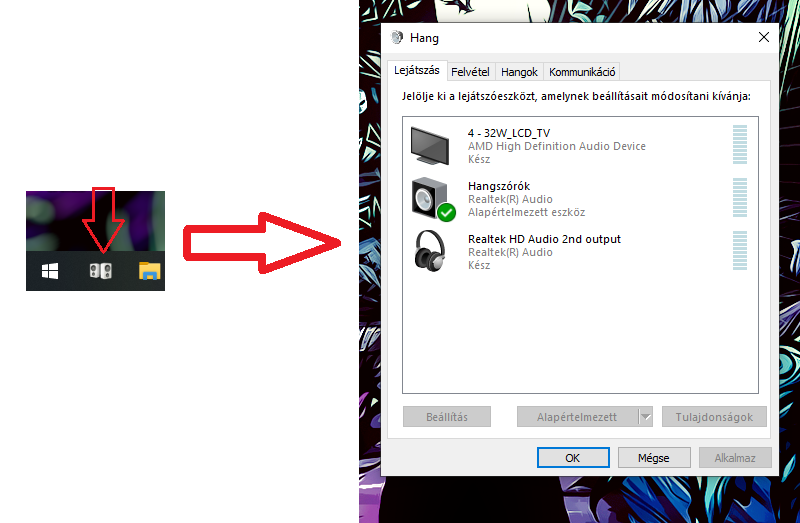

# Windows-Default-sound-device-changer
It literally opens your playback devices but you can pin the exe to your taskbar making it so much easier to access.

[Download](https://github.com/Nevermind5214/Window-Default-sound-device-changer/raw/main/Sound/bin/Release/Sound.exe)
